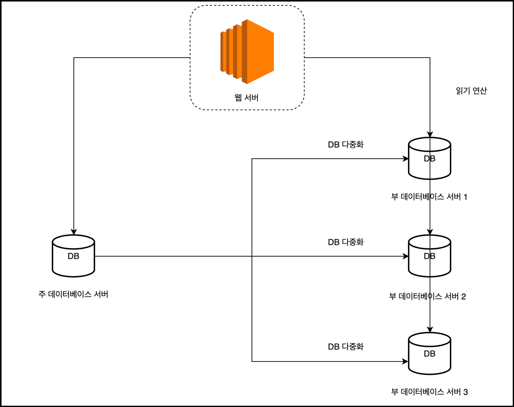

# 1장 사용자 수에 따른 규모 확장성  

후기: 오마이갓 내용 정말 많다... ^ ^)b

## 단일 서버
* 단일 서버의 과정을 알아보자
    1. 사용자는 도메인 이름을 이용하여 웹 사이트에 접속한다. 
    2. DNS를 이용해서 IP주소로 변환해준다.  
    3. 해당 주소로 HTTP 요청이 전달된다.  
    4. 요청받은 웹 서버는 HTML이나 JSON 형태의 응답을 반환한다.  
       (이 요청은 두 종류의 단말로부터 온다. 웹 앱 / 모바일 앱)

 

## 데이터베이스  
사용자가 늘게 여러 서버를 두어야 한다.  
하나는 웹/모바일 트래픽 처리 용도(**웹 계층**)로, 하나는 데이터베이스용(**데이터 게층**)이다.  
분리를 통해 각각을 독립적으로 확장해갈 수 있다.  

* 어떤 데이터베이스를 사용할까?  
    관계형 데이터베이스와 비관계형 데이터베이스가 존재한다.  
    1. 관계형 데이터베이스 - 자료를 테이블과 열, 칼럼으로 표현한다. JOIN을 이용하여 관계를 합칠 수 있다.  
    2. 비관계형 데이터베이스 - `키-값` 저장소, 그래프 저장소, 칼럼 저장소, 문서 저장소로 분류할 수 있다. 일반적으로 조인 연산은 지원하지 않는다.
 

**+) 비관계형 데이터베이스가 추천되는 경우**  
  1. 아주 낮은 응답 지연 시간이 요구됨.   
  2. 다루는 데이터가 비정형인 경우    
  3. 데이터를 직렬화하거나 역직렬화할 수 있기만 하면 된다.    
  4. 아주 많은 양의 데이터를 저장할 경우   

 

## 수직적 규모 확장 VS 수평적 규모 확장

> 수직적 규모 확장(`scale up`)은 **서버에 고사양 자원을 추가**하는 행위이다.  

서버로 유입되는 트래픽의 양이 적은 경우 추천된다.  
단순하다.  
한 대의 서버에 CPU나 메모리를 무한대로 증설할 수 없다는 단점이 있다.  
장애에 대한 자동복구 방안이나 다중화 방안을 제시하지 않는다.  

 

> 수평적 규모 확장은(`scale out`) **더 많은 서버를 추가**하여 성능을 개선하는 행위이다. 

많은 사용자가 접속하여 서버가 한계에 도달하면 응답 속도나 장애가 발생할 수 있다.   
그렇기에 분산을 해결하기 위해 **부하 문산기**나 **로드 밸런서**를 도입하는 것이 좋다.  

   

### 로드 밸런서 - 웹 계층
로드 밸런서는 부하 분산 집합에 속한 웹 서버들에게 트래픽 부하를 고르게 분산하는 역할을 한다.  
서버 간 통신에는 사설 IP 주소가 사용된다. (이 주소를 이용하여 접근할 수 없다.)  
로드 밸런서는 웹 서버와 통신하기 위해 이 사설 주소를 이용한다.  

웹 서버를 하나 더 두어 장애 문제를 해결할 수 있으며, 웹 계층의 가용성은 향상된다.  

> 서버1이 다운되면 모든 트래픽은 서버2로 전송된다.   
> 이를 통해 웹 사이트 전체가 다운되는 일을 방지한다.  
> 부하를 나누기 위해 새로운 서버를 추가할 수 있다.  
> 로드 밸런서가 자동적으로 트래픽을 분산하기 시작한다.  

### 데이터베이스 다중화  

보통은 master - slave 간계를 설정한다.  
쓰기 연산은 master에서만 지원한다, 
slave 데이터베이스는 사본을 전달받으며 읽기 연산을 진행한다.  

대부분의 애플리케이션은 읽기 연산의 비중이 쓰기 연산보다 훨씬 높다.  
그렇기에 많은 부-데이터베이스를 가진다.  

**효과**
1. 더 나은 성능    
데이터의 변경은 주-데이터베이스 서버로 전달되고 읽기 연산은 부-데이터베이스 서버로 전달된다.  
이를 통해 병렬로 처리될 수 있는 질의의 수가 늘어나 성능이 좋아진다.  
2. 안정성  
서버의 일부가 파괴되어도 데이터는 보존된다.  
3. 가용성   
데이터를 여러 지역에 복제하여 하나의 데이터베이스에 장애가 발생하여도 다른 데이터베이스를 가져와 계속 서비스를 유지할 수 있다.  

> 다운된다면?
> 1. 부-데이터베이스가 다운된다면  
> 읽기 연산은 한시적으로 모두 주-데이터베이스로 전달된다.     
> 즉시 새 부-데이터베이스 서버가 장애를 대체할 것이다.    
> 2. 주-데이터베이스가 다운된다면  
> 한 대의 부-데이터베이스만 있는 경우 해당 데이터베이스가 새로운 주-데이터베이스가 된다.    
> 또한 모든 데이터베이스 연산은 일시적으로 새로운 주-서버에서 수행될 것이다.   
>  ++) 거기에 production인 경우
>   없는 데이터는 복구 스크립트를 통해 추가해야 한다.  
>  다중 마스터나 원형 다중화 방식을 도입하면 이러한 상황에 대처할 때 도움은 된다.  

 

## 캐시 
응답 시간은 캐시를 붙이고 정적 콘텐츠를 콘텐츠 전용 네트워크(CDN)로 옮기면 개선할 수 있다.  

캐시는 자주 참조되는 데이터를 메모리 안에 두고 요청에 대해 빠른 응답을 할 수 있도록 하는 저장소이다.  

### 캐시 계층  
캐시 계층은 데이터가 잠시 보관되는 곳으로 데이터베이스보다 훨씬 빠르다.  
별도의 캐시 계층을 두면 성능이 개선되며 데이터베이스의 부하를 줄일 수 있다.  

* **캐시의 동작 방법**
1. 읽기 주도형 캐시 전략 - 먼저 캐시를 확인한 후에 있다면 해당 데이터를 클라이언트에 반환한다. 없는 경우에는 데이터베이스 쿼리를 통해 데이터를 찾아 캐시에 저장한 후에 클라이언트에 반환한다.  
2. 쓰기 주도형 캐시 전략 - 데이터를 DB에 쓸 때마다 캐시에 데이터를 추가/업데이트한다. 

* **캐시 사용 시 유의할 점**
1. 데이터의 갱신이 빈번하게 일어나지 않을 때 사용한다.  
2. 휘발성 메모리이기에 중요한 데이터를 넣기에는 바람직하지 않다.  
3. 만료 정책을 두어 캐시에서 데이터가 삭제되게 한다. 이를 통해 원본과의 차이를 줄일 수 있다.
4. 일관성이 깨질 수 있으니 유의해야 한다.  
5. 여러 지역에 걸쳐 캐시 서버를 분산시켜야 한다.  
6. 캐시의 메모리가 너무 작으면 문제가 일어나기에 과할당을 하는 것이 좋다.  
7. 캐시 데이터 방출 정책은 주로 LRU 알고리즘이 사용된다.  

 

## CDN (Contents Delivery Network)
정적 콘텐츠를 전송하는 데 쓰이는, 지리적으로 분산된 서버의 네트워크이다.  
이미지, 비디오, CSS, Javascript 파일 등을 캐시할 수 있다. 

### 동작 원리
1. 어떤 사용자가 웹 사이트에 방문한다.
2. 그 사용자에게 가장 가까운 CDN 서버가 정적 콘텐츠를 전달하게 된다.  
3. 사용자가 CDN 서버로부터 멀면 멀수록 웹사이트는 천천히 로딩된다.

a. 사용자가 이미지 URL을 이용하여 이미지에 접근한다. 해당 도메인은 CDN 사업자가 제공한 것이다.   
b. CDN서버의 캐시에 해당 이미지가 없는 경우, 서버는 원본 서버에 요청하여 파일을 가져온다.  
c. 원본 서버가 파일을 CDN 서버에 반환한다.  
d. CDN 서버는 파일을 캐시하고 사용자에게 반환한다.  
e. 만료되지 않은 이미지에 대한 요청은 캐시를 통해 반환된다.  

* **고려해야 할 점**
1. 적절한 만료 시한 설정 
2. CDN 장애에 대한 대처 방안   
3. 콘텐츠 무효화  

 

## 무상태 웹 계층 stateless  

상태 정보를 웹 계층에서 제거해야 한다.  
상태 정보를 관계형 데이터베이스나 NoSQL과 같은 지속성 저장소에 보관하고 필요할 때 가져오는 것이다.  

  
* **상태 정보 의존적인 아키텍처**  
상태 정보를 보관하는 서버는 상태를 유지ㅎ여 요청들 사이에 굥유되도록 한다.  
무상태 서버에는 이런 장치가 없다.   

* **무상태 아키텍쳐**
사용자로부터의 HTTP 요청은 어떤 웹 서버로도 전달될 수 있다.   
웹 서버는 상태 정보가 필요할 경우 공유 저장소로부터 데이터를 가져온다.   

상태 정보는 웹 서버로부터 물리적으로 분리되어 있다.   
안정적이고 단순하고 규모의 확장이 쉽다.  

 

## 데이터센터  

사용자는 가까운 데이터 센터로 안내된다.  
이는 지리적 라우팅이라고 부른다.  

지리적 라우팅은 사용자의 위치에 따라 도메인 이름을 어떤 IP 주소로 변환할 지 정할 수 있도록 해주는 DNS 서비스이다.  

 

## 메시지 큐  

메시지의 무손실을 보장하는 비동기 통신을 지원하는 컴포넌트이다.  
메시지의 버퍼 역할을 하며 비동기적으로 전송한다. 

생산자 또는 발행자로 불리는 입력 서비스가 메시지를 만들어 메시지 큐에 발행한다.   
큐에는 보통 소비자/구독자라 불리는 서비스 혹은 서버가 연결되어 있는데 메세지를 받아 그에 맞는 동작을 수행한다. 

 

## 로그, 매트링 그리고 자동화

- 로그: 에러 로그를 모니터링하는 것은 중요하다. 로그를 모아주는 서비스를 이용하면 편리하게 검색할 수 있다. 
- 메트릭: 사업 현황엗 ㅐ한 유용한 정보를 어등ㄹ 수 있다.  
- 자동화: 시스템이 크고 복잡해지면 생산성을 위해 자동화 도구를 활용해야 한다.  

 

## 데이터베이스의 규모 확장  

* **수직적 확장**
고성능의 자원을 증설하는 방법이다.  
SPOF로 인한 위험성이 크다.  
비용이 많이 든다.    
    

* **수평적 확장**
샤딩이라고도 불리며 더 많은 서버를 추가함으로써 성능을 높일 수 있다.  
샤딩은 대규모 데이터베이스를 샤드라고 부르는 작은 단위로 분할하는 기술이다.   
모든 샤드는 같은 스키마를 쓰지만 샤드에 보관되는 데이터 사이에는 중복이 없다.  

샤딩 키는 파티션 키로 데이터가 어떻게 분산될 지 정하는 하나 이상의 칼럼으로 구성된다.  

