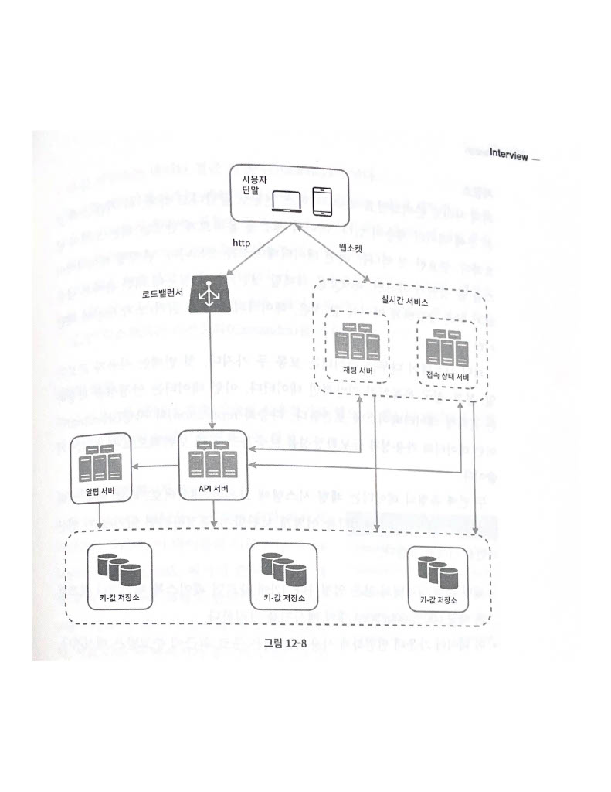

## 12장 채팅 시스템 설계  

### 1단계 문제 이해 및 설계 범위 확정  

면접관이 원하는 앱이 정확히 무엇인지 파악해야 한다.  
설계 대상이 1:1 채팅 앱인지, 그룹 채팅 앱인지 알아야 한다.   

- 응답지연이 낮은 일대일 채팅 기능
- 최대 100명까지 참여할 수 있는 그룹 채팅 기능  
- 사용자의 접속사앹 표시 기능  
- 다양한 단말 지원, 하나의 계정으로 여러 단말에 동시 접속 지원  
- 푸시 알림   

+) 5천만 DAU(Daily Active User)를 처리할 수 있어야 한다.    

### 2단계 개략적 설계안 제시 및 동의 구하기  

클라이언트와 서버의 통신 방법에 대한 기본적인 지식을 갖추고 있어야 한다.  
해당 시스템의 경우 클라이언트는 모바일 앱이거나 웹 애플리케이션이다.  
클라이언트는 서로 직접 통신하지 않는다.  
클라이언트는 나열한 모든 기능을 지원하는 채팅 서비스와 통신한다.  

* 기본 기능
1. 클라이언트들로부터 메세지 수신
2. 메시지 수신자 결정 및 전달
3. 수신자가 접속 상태가 아닌 경우에는 접속할 때까지 해당 메시지 보관  

채팅을 시작하는 클라이언트는 네트워크 통신 프로토콜을 사용하여 서비스에 접근한다.  
대부분의 클라이언트/서버 애플리케이션에서 요청을 보내는 것은 클라이언트이며 채팅 서비스도 이와 마찬가지이다.  
메시지 송신 클라이언트가 해당 역할을 한다.  
송신 클라이언트는 수신 클라이언트에게 전달할 메시지 전달할 메시지를 채팅 서비스에 보낼 때, HTTP 프로토콜을 사용한다.  
클라이언트는 해당 채팅 서비스에 HTTP 프로토콜로 연결한 다음 메시지를 보내어 수신자에게 해당 메시지를 전달하라고 알린다.  
채팅 서비스와의 접속에는 kepp-alive 헤더를 사용하면 효율적이다. 해당 헤더는 클라이언트와 서버 사이의 연결을 끊지 않고 계속 유지할 수 있어서이다.  
TCP 접속 과정에서 발생하는 핸드셰이크 횟수를 줄일 수 있음은 물론이다.  

서버가 연결을 만드는 것처럼 동작할 수 있도록 하기 위해 많은 기법이 제안되어 왔는데, 폴링, 롱 폴링, 웹소켓 등이 해당 기술들이다.  

**폴링**  

폴링은 클라이언트가 주기적으로 서버에게 새 메시지가 있냐고 물어보는 방법이다.  
폴링 비용은 폴링을 자주하면 할수록 올라간다. 답해줄 메시지가 없는 경우에는 서버 자원이 불필요하게 낭비된다는 문제도 있다.  

**롱 폴링**  
클라이언트는 새 메시지가 반환되거나 타임아웃될 때까지 연결을 유지한다.  
클라이언트는 새 메시지를 받으면 기존 연결을 종료하고 서버에 새로운 요청을 보내어 모든 절차를 다시 시작한다.  

단점으로는   
1. 메시지를 보내는 클라이언트와 수신하는 클라이언트가 같은 채팅 서버에 접속하게 되지 않을 수 있더.  
로드 밸런싱을 위해 라운드 로빈 알고리즘을 사용하는 경우, 메시지를 받은 서버는 해당 메시지를 수신할 클라이언트와의 롱 폴링 연결을 가지고 있지 않은 서버일 수 있다.  
2. 서버의 입장에서는 클라이언트가 연결을 해제했는지 알 수 있는 방법이 없다. 
3. 여전히 비효율적이다.

**웹소켓**  
서버가 클라이언트에게 비동기 메시지를 보낼 때 가장 널리 사용하는 기술이다.  
웹소켓 연결은 클라이언트가 시작한다.   
한번 맺어진 연결은 항구적이며 양방향이다.  
처음에는 HTTP 연결이지만 특정 핸드세이크 절차를 걸쳐 웹소켓 연결로 업그레이드 된다.  

웺소켓은 일반적으로 방화벽이 있는 환경에서도 잘 동작한다. 기본 포트번호를 그대로 쓰기 때문이다.  

웹소켓을 이용하면 메시지를 보낼 때나 받을 때 동일한 프로토콜을 사용할 수 있어 설계와 구현이 단순하고 직관적이다.  
웹소켓 연결은 항구적으로 유지되어야 하기 때문에 서버 측에서 연결 관리를 효율적으로 해야 한다는 것이다.  

**개략적 설계안**  

채팅 시스템은 무상태 서비스, 상태유지 서비스, 제3자 서비스 연동의 세 부분으로 나누어 살펴볼 수 있다.  

1. 무상태 서비스
: 해당 서비스는 로드밸런서 뒤에 위치한다. 로드 밸런서가 하는 일은 요청을 그 경로에 맞는 서비스로 정확하게 전달하는 것이다.  
: 로드 밸런서 뒤에 나오는 서비스는 서비스 탐색, 인증 서비스, 그룹 관리, 사용자 프로파일이 있다.    

2. 상태 유지 서비스  
: 상태 유지가 필요한 서비스는 채팅 서비스이다. 각 클라이언트가 채팅 서버와 독립적인 네트워크 연결을 유지해야 하기 때문이다.  
: 클라이언트는 보통 서버가 살아있는 한 다른 서버로 연결을 변경하지 않는다.  

3. 제3자 서비스 연동
: 제3자 서비스는 푸시 알림이다.   
: 새 메시지를 받았다면 앱이 실행중이지 않더라도 알림을 받아야 한다.  

4. 규모 확장성  
: 대량의 트래픽을 처리해야 하는 경우에도 이론적으로는 모든 사용자 연결이 최신 클라우드 서버 한대로 처리할 수 있기도 하다.  
: 하지만 서버 한 대로 처리하는 것은 SPOF의 이유로 안좋다.  

유의해야 할 것은 실시간으로 메시지를 주고받기 위해 클라이언트는 채팅 서버와 웹소켓 연결을 끊지 않고 연결한다는 점이다.  
- 채팅 서버는 클라이언트 사이에 메시지를 중계하는 역할을 담당한다.  
- 접속상태 서버는 사용자의 접속 여부를 관리한다.  
- API 서버는 로그인, 회원가입, 프로파일 변경 등 그 외 나머지 전부를 관리한다.  
- 알림 서버는 푸시 알림을 보낸다.  
- 키-값 저장소에는 채팅 이력을 보관한다. 

**저장소**  

데이터의 유형과 읽기/쓰기 연산의 패턴이 중요하다.  
1. 사용자 프로파일, 설정, 친구 목록과 같이 일반적인 데이터는 안정성을 보장하는 관계형 데이터베이스에 보관한다.   
다중화와 샤딩은 이런 데이터의 가용성과 규모확장성을 보증하기 위해 보편적으로 사용되는 기술이다.  

2. 채팅 시스템에 고유한 데이터로 채팅 이력이다. 이 양은 엄청나다. 매일 600억 개의 메시지를 처리한다.   
빈번하게 사용되는 것은 주로 최근에 주고받은 메시지이다. 검색 기능을 이용하거나, 특정 사용자가 언급된 메시지를 보거나,  
특정 메시지로 점프하거나 하여 무작위적인 데이터 접근을 하게 되는 일도 있다.  
1:1 채팅 앱의 경우 읽기:쓰기의 비율이 1:1이다.  

추천하는 데이터베이스는 키-값 저장소이다. 그 이유로는   
1. 수평적 규모 확정이 쉽다.  
2. 데이터 접근 지연시간이 낮다.

### 데이터 모델  

메시지 데이터를 어떻게 보관할까?  

**1:1 채팅을 위한 메시지 테이블**  
pk인 message_id, created_at, message_from, message_to, content.  
message_id를 통해 순서를 알 수 있다.  

**그룹 채팅을 위한 메시지 테이블**  

channel_id, message_id, message_to, content, created_at  
channel_id와 message_id의 복합키를 기본 키로 사용한다.  
channel_id는 채팅 그룹, 파티션 키로도 사용하다.    

**메시지 ID**  
순서를 표현할 수 있어야 한다.  
1. 값은 고유해야 한다.
2. id값은 정렬 가능해야 하며 시간 순서와 일치해야 한다.  

이를 해결할 수 있는 방법은 RDBMS라면 auto-increment가 있다.  
혹은 스노플레이크같은 전역적 64-bit 순서 번호 생성기를 이용하는 것이다.  
마지막 방법으로는 지역적 순서 번호 생성기를 이용하는 것이다.  
여기서 id의 유일성은 같은 그룹 안에서만 보증하면 충분하다는 점이다.  

### 3단계 상세 설계  

채팅 시스템의 경우 서비스 탐색, 메시지 전달 흐름, 사용자 접속 상태를 표시하는 방법을 살펴보자.  

**서비스 탐색**  
클라이언트에게 가장 적합한 채팅 서버를 추천하는 것이다.  
사용되는 기준은 클라이언트의 위치, 서버의 용량 등이 있다.  

이 기능을 구현하는 데 널리 쓰이는 오픈 소스로는 아파치 주키퍼가 있다.   
사용 가능한 모든 채팅 서버를 여기 등록시켜 두고, 클라이언트가 접속을 시도하면 사전에 정한 기준에 따라 최적의 채팅 서버를 골라주면 된다.  

- 과정
1. 사용자가 시스템에 로그인을 시도한다.  
2. 로드밸런서가 로그인 요청을 API 서버들 가운데 하나로 보낸다.  
3. API 서버가 상요자 인증을 처리하고 나면 서비스 탐색 서비스 기능이 동작하여 해당 사용자를 서비스할 최적의 채팅 서버를 찾는다.  
4. 사용자는 반환받은 채팅 서버와 웹소켓 연결을 맺는다.  

**메시지 흐름**  

1. 1:1 채팅 메시지 처리 흐름    
: 1. 사용자1가 채팅 서버1로 메시지 전송  
: 2. 채팅 서버1은 ID 생성기를 사용하여 해당 메세지의 ID 결정  
: 3. 채팅 서버1은 해당 메시지를 메시지 동기화 큐로 전송   
: 4. 메시지가 키-값 저장소에 보관됨  
: 5. 사용자2가 접속 중인 경우 메시지는 사용자2가 접속 중인 채팅 서비2로 전송됨. 사용자2가 접속 중이 아닌 경우 푸시 알림 메시지를 푸시 알림 서버로 보냄.  
: 6. 채팅 서버2는 메시지를 사용자2에게 전송. 사용자2와 채팅 서버2 사이에는 웹소켓 연결이 있는 상태로 그걸 이용

2. 여러 단말 사이의 메시지 동기화
: 사용자1은 전화기와 랩탑의 두 대의 단말을 이용하고 있다. 사용자1이 전화기에서 채팅 앱에 로그인한 결과로 채팅 서버1과 해당 단말 사이에 웹소켓 연결이 만들어져있다.  
: 랩탑에서 로그인한 결과로 역시 별도 웹소켓이 채팅 서버1에 연결되어 있는 상태이다.  
: 각 단말은 cur_max_message_id라는 변수를 유지하는데, 해당 단말에서는 관측된 가장 최신 메시지의 ID를 추적하는 용도이다.  
: - 새 메시지로 간주하는 경우 
:  1. 수신자 ID가 현재 로그인한 사용자 ID와 같다.  
:  2. 키-값 저장소에 보관된 메시지로서, 그 id가 cur_max_message_id보다 크다.  
: cur_max_message_id는 단말마다 별도로 유지 괸리하면 되는 값이라 키-값 저장소에서 새 메시지를 가져오는 동기화 작업도 쉽게 구현할 수 있다.  

3. 소규모 그룹 채팅에서의 메시지 흐름  
: 사용자1이 메시지를 보낸 메시지가 사용자2, 사용자3의 메시지 동기화 큐에 복사된다.   
: 이 큐를 사용자 각각에 할당된 메시지 수신함 같은 것이다.  
: 이 경우는 소규모 그룹 채팅에 적합하다.  하지만 많은 사용자를 지원하려면 똑같은 메시지를 모든 사용자의 큐에 복사하는 것은 바람직하지 않다.  
: 한 수신자는 여러 사용자로부터 오는 메시지를 수신할 수 있어야 한다.  
: 각 사용자의 수신함, 즉 메시지 동기화 큐는 여러 사용자로부터 오는 메시지를 받을 수 있어야 한다.  

4. 접속 상태 표시  
: 접속상태 서버를 통해 사용자의 상태를 관리한다고 했었다.  
: 접속 상태 서버는 클라이언트와 웹소켓으로 통신하는 실시간 서비스의 일부이다.  
: 1. 사용자 로그인   
: - 클라이언트와 실시간 서버스 사이에 웹소켓 연결이 맺어지고 나면 접속 상태 서버는 사용자의 상태와 last_active_at 타임스탬프 값을 키-값 저장소에 보관한다.  
: 2. 로그아웃  
: - 키-값 저장소에 보관된 사용자 상태가 online에서 offline으로 바뀌게 된다는 점이다. 이 절차를 통해 사용자의 상태는 접속중이 아닌 것으로 표시된다.  
: 3. 접속상애 
: - 사용자의 인터넷 연결이 끊어지면 클라이언트와 서버 사이에 맺어진 웹소켓같은 지속성 연결도 끊어진다.  
: - 사용자를 오프라인 상태로 표시하고 연결이 복구되면 온라인 상태로 변경하는 것이다,  
: - 하지만 짧은 시간동안 인터넷 연결이 끊어지고 다시 연결되는 일은 흔하다.  
: - 그렇기에 박동 검사를 통해 해당 문제를 해결한다.  

+) 박동 검사 ?  
: 온라인 상태의 클라이언트로 하여금 주기적으로 박동 이벤트를 접속상태 서버로 보내도록 한다.  
: 마지막 이벤트를 받은 지 해당 초 이네에 또 다른 박동 이벤트 메시지를 받으면 해당 사용자의 상태를 온라인으로 유지하는 것이다.

5. 상태 정보의 전송  
: 상태정보 서버는 발행-구독 모델을 사용하는데 각각의 친구 관계마다 채널을 하나씩 둔다.  
: 그룹의 크기가 작을 때에는 효과적이다.  하지만 비용이나 시간이 많이 들 수 있다는 단점이 있다.  
: 사용자가 그룹 채팅에 입장하는 순간에만 상태 정보를 읽어가게 하거나, 친구 리스트에 있는 사용자의 접속 상태를 갱신하고 싶으면 수동으로 하도록 유도하는 것이다.  

### 4단계 마무리   

* 알게 된 부분  
: 웹소켓 사용  
: 실시간 메시징을 지원하는 채팅 서버 
: 접속 상태 서버   
: 푸시 알림 서버 
: 채팅 이력을 보관할 키-값 보관소  

* 논의하면 좋을 내용  
1. 채팅 앱을 확장하여 사진이나 비디오 등의 미디어를 지원하도록 하는 방법  
2. 종단 간 암호화  
3. 캐시 
4. 로딩 속도 개선  
5. 오류 처리 

