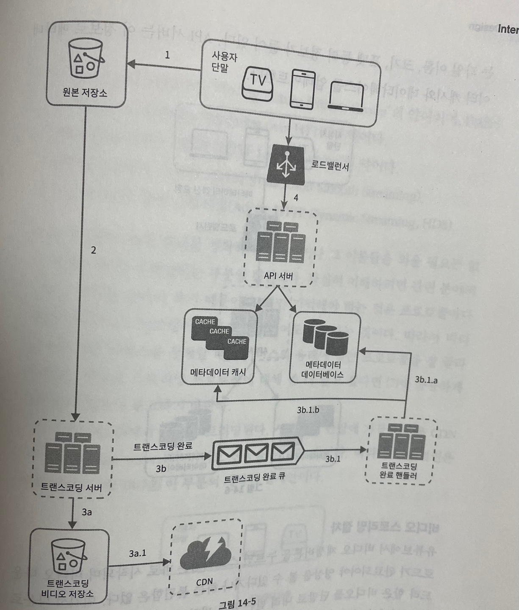
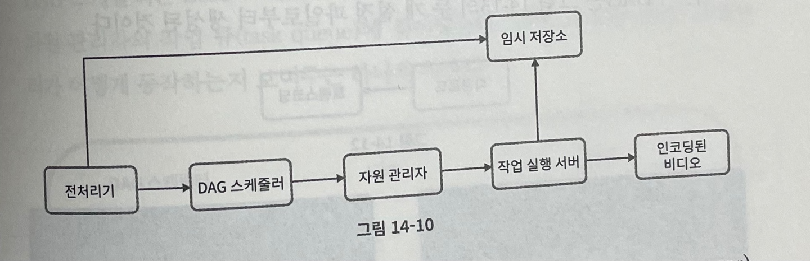

## 14장 유튜브 설계  

### 1단계 문제 이해 및 설계 범위 확정  

- 비디오를 올리는 기능과 시청하는 기능이 가장 중요하다.  
- 모바일 앱, 웹 브라우저, 스마트 tv  
- 일간 능동 사용자 수는 5백만..이다.  
- 평균 소비 시간은 30분 (평균 5개의 비디오 시청)
- 모든 언어로 이용 가능해야 한다.  
- 현존하는 비디오 종류와 해상도를 대부분 지원해야 한다.  
- 암호화가 필요하다  
- 작은 비디오, 중간 크기 비디오에 초점을 맞춰야 한다.  
- 클라우드 서비스를 활용해도 된다.
- 비디오 평균의 크기 300MB

### 2단계 개략적 설계안 제시 및 동의 구하기   
3개의 컴포넌트로 구성된다.  
1. 단말: 컴퓨터, 모바일 폰, 스마트 TV를 통해서 유튜브를 시청할 수 있다.  
2. CDN: 비디오는 CDN에 저장한다. 재생 버튼을 누르면 CDN으로부터 스트리밍이 이루어진다.  
3. API 서버: 비디오 스트리밍을 제외한 모든 요청은 API 서버가 처리한다. 
피드 추천, 비디오 업로드 URL 생성, 메타데이터 데이터베이스와 캐시 갱신, 사용자 가입 등등이 API 서버가 처리하는 작업한다.   

여기서 설계해야 할 부분은 비디오 업로드 절차, 비디오 스트리밍 절차이다.  

**비디오 업로드 절차**  
- 사용자: 컴퓨터나 모바일 폰, 스마트 tv를 통해 유튜브를 시청하는 이용자이다.  
- 로드밸런서: API 서버 각각으로 고르게 요청을 분산하는 역할을 담당한다. 
- API 서버: 비디오 스트리밍을 제외한 다른 모든 요청을 처리한다.  
- 메타데이터 데이터베이스: 비디오의 메타데이터를 보관한다. 
샤딩과 다중화를 적용하여 성능 및 가용성 요구사항을 충족한다. 
- 메타데이터 캐시: 성능을 높이기 위해 비디오 메타데이터와 사용자 객체는 캐시한다.  
- 원본 저장소: 원본 비디오를 보관할 대형 이진 파일 저장소 시스템이다.  
- 트랜스코딩 서버: 비디오 트랜스코딩은 비디오 인코딩이라 부르기도 하는 절차로 비디오의 포멧 등을 변환하는 절차이다. 
단말이나 대역폭 요구사항에 맞는 최적의 비디오 스트림을 제공하기 위해 필요하다.  
- 트랜스코딩 비디오 저장소: 트랜스코딩이 완료된 비디오를 저장하는 BLOB 저장소이다.  
- CDN: 비디오를 캐시하는 역할을 담당한다. 사용자가 재생 버튼을 누르면 비디오 스트리밍은 CDN을 통해 이뤄진다.  
- 트랜스코딩 완료 큐: 비디오 트랜스코딩 완료 이벤트를 보관할 메시지 큐다.  
- 트랜스코딩 완료 핸들러: 트랜스코딩 완료 쿠에서 이벤트 데이터를 꺼내어 메타데이터 캐시와 데이터베이스를 갱신할 작업 서버들이다.  

 

여기서 이제 비디오 업로드가 어똫게 이뤄질까?   
1. 비디오 업로드
2. 비디오 메타데이터 갱신 (비디오 url, 크기, 해상도, 포맷, 사용자 정보가 포함된다.)  

 

**a. 비디오 업로드**  
- 비디오를 원본 저장소에 업로드한다.  
- 트랜스코딩 서버는 원본 저장소에서 해당 비디오를 가져와 트랜스코딩을 시작한다.  
- 트랜스코딩이 완료되면 아래 두 절차가 병렬적으로 수행된다.
  - 완료된 비디오를 트랜스코딩 비디오 저장소를 업로드한다.  
  - 트랜스코딩 완료 이벤트를 트랜스코딩 완료 쿠에 넣는다.  
    - 트랜스 코딩이 끝난 비디오를 CDN에 올린다.  
    - 완료 핸들러가 이벤트 데이터를 큐에서 꺼낸다.  
    - 완료 이벤트가 메타데이터 데이터베이스와 캐시를 갱신한다.  
- API 서버가 단말에게 비디오 업로드가 끝나서 스트리밍 준비가 되었음을 알린다.  

**b. 메타데이터 갱신**  
원본 저장소에 파일이 업로드되는 동안, 단말은 병렬적으로 비디오 메타데이터 갱신 요청을 API 서버에 보낸다.  
메타 데이터에는 파일 이름, 크기, 포맷 등의 정보가 들어있다.  
API 서버는 이 정보로 메타데이터 캐시와 데이터베이스를 업데이트한다.  

**비디오 스트리밍 절차**  
스트리밍 프로토콜이란 개념을 먼저 알아야 한다.  
스트리밍 프로토콜은 비디오 스트리밍을 위해 데이터를 전송할 때 쓰이는 표준화된 통신방법이다.  
(`MPEG-DASH`, 애플의 `HLS`, 마이크로소프트 스무드 스트리밍, 어도비 `HTTP` 동적 스트리밍)  

프로토콜마다 지원하는 비디오 인코딩이 다르고 플레이어도 다르다는 것을 기억해야 한다.  
비디오 스트리밍 서비스를 설계할 때에는 그에 맞는 프로토콜을 잘 골라야 한다.  

비디오는 CDN에 바로 스트리밍된다. 사용자 단말에 가장 가까운 CDN 에지 서버가 비디오 전송을 담당할 것이다.  

### 3단계 상세 설계  

**1. 비디오 트랜스코딩**  
비디오를 녹화하면 단말은 해당 비디오를 특정 포맷으로 저장한다. 
이 비디오가 다른 단말에서도 순조롭게 재생되려면 다른 단말과 호환되는 비트레이트와 포맷으로 저장되어야 한다. 

비트레이트는 비디오를 구성하는 비트가 얼마나 빨리 처리되어야 하는지를 나타내는 단위이다.  
비트레이트가 높은 비디오는 일반적으로 고화질 비디오이며 이를 정상 재생하려면 높은 성능의 컴퓨팅 파워가 필요하다.  

* 비디오 트랜스코딩이 중요한 이유 
- 가공되지 않은 비디오는 저장 공간을 많이 차지한다.  
- 상당수의 단말과 브라우저는 특정 종류의 비디오 포맷만 지원한다.  
- 사용자에게 끊김없는 비디오 재생을 보장하려면 네트워크 대역폭에 따라 그에 맞는 품질의 비디오를 보내는 것이 바람직하다.  
- 모바일 단말의 경우 네트워크 상황이 수시로 달라질 수 있다.  

인코딩 포맷은 아주 다양하다. 두 부분으로 구서오디어 있다.  
1. 컨테이너: 비디오 파일, 오디오, 메타데이터를 담는 바구니같은 것이다.  
2. 코덱: 비디오 화질은 보존하면서 파일 크기를 줄일 목적으로 고안한 압축 및 압축 해제 알고리즘이다.  

**유향 비순환 그래프 모델**  
각기 다른 유형의 비디오 프로세싱 파이프라인을 지원하는 한편 처리 과정의 병렬성을 높이기 위해서는 적절한 수준의 추상화를 도입하여 클라이언트
프로그래머로 하여금 실행할 작업을 손수 정의할 수 있도록 해야 한다.  

원본 비디오는 일단 비디오, 오디오, 메타데이터 세 부분으로 나누어 처리된다.  
비디오는 검사와 비디어 인토딩, 섬네일, 워터마크의 작업을 걸친다.  
- 검사: 좋은 품질의 비디오인지, 손상은 없는지 확인하는 작업이다.  
- 비디오 인코딩: 비디오를 다양한 해상도, 코덱, 비트레이트 조합으로 인코딩하는 작업이다.  
- 섬네일: 사용자가 업로드한 이미지나 비디오에서 자동 추출된 이미지로 섬네일을 만드는 작업이다.  
- 워터마크: 비디오에 대한 식별 정보를 이미지 위에 오버레이 형태로ㄷ 띄워 표시하는 작업이다.

**비디오 트랜스코딩 아키텍쳐**  

  
이 다섯개의 절차를 걸쳐 인코딩된 비디오가 만들어진다.  

**1. 전처리기**  
전처리기가 하는 일은 3개이다.  
비디오 분할: 비디오 스트림을 GOP라고 불리는 단위로 쪼갠다.   
DAG 생성: 클라이언트 프로그래머가 작성한 설정 파일에 따라 DAG를 만들어 낸다.   
데이터 캐시: 전처리기는 분할된 비디오의 캐시이기도 한다.   

**2. DAG 스케줄러**    
DAG 스케줄러는 DAG 그래프를 몇 개 단계로 분할한 다음에 그 각각을 자원 관리자의 작업 큐에 집어넣는다.  

첫 단계에서는 비디오, 오디오, 메타데이터를 분리한다. 두번째 단계에서는 해당 비디오 파일을 인코딩하고 섬네일을 추출하며 오디오 파일 또한 인코딩한다.  

**3. 자원 관리자**   
자원 배분을 효과적으로 수행하는 역할을 담당한다. 세 개의 큐와 작업 스케줄러로 구성된다.  

작업 큐: 실행할 작업이 보관되어 있는 우선순위 큐이다.  
작업 서버 큐: 작업 서버의 가용 상태 정보가 보관되어 있는 우선순위 큐이다.
실행 큐: 현재 실행 중인 작업 및 작업 서버 정보가 보관되어 있는 큐이다.  
작업 스케줄러: 최적의 작업/서버 조합을 골라 해당 작업 서버가 작업을 수행하도록 지시하는 역하을 담당한다.  

**작업 관리자의 역할**  
- 작업 관리자는 작업 큐에서 가장 높은 우선순위의 작업을 꺼낸다.  
- 작업 관리자는 해당 작업을 실행하기 적합한 작업 서버를 고른다. 
- 작업 스케줄러는 해당 작업 서버에게 작업 실행을 지시한다.  
- 작업 스케줄러는 해당 작업이 어떤 서버에게 할당되었는지에 관한 정보를 실행 큐에 넣는다.  
- 작어 ㅂ스케줄러는 작업이 완료되면 해당 작업을 실행 큐에서 제거한다.  

**4. 작업 서버**  
작업 서버는 DAG에 정의된 작업을 수행한다. 작업 종류에 따라 작업 서버도 구분하여 관리한다.  

**5. 임시 저장소**
메타데이터는 서버가 빈번히 참조하고 크기도 작기에 메모리에 캐시하면 좋다.  
비디오/오디오 데이터는 BLOB 저장소에 두는 것이 바람직하다.  

**6. 인코딩된 비디오**  
인코딩된 비디오는 인코딩 파이프라인의 최종 결과물이다.  
 
**시스템 최적화**  
속도, 안정성, 비용 측면에서 최적화해야 한다.  

1. 속도 최적화: 비디오 병렬 업로드    
하나의 비디오를 작은 GOP들로 분할할 수 있다.  
분할한 GOP를 병렬적으로 업로드하면 일부가 실패해도 빠르게 업로드를 재개할 수 있다.  

2. 속도 최적화: 업로드 센터를 사용자 근거리에 지정    
업로드 센터를 여러 곳에 두는 것이 좋다.  
이 설계안은 CDN을 업로드 센터로 이용한다.  

3. 속도 최적화: 모든 절차를 병렬화   
느슨하게 결합된 시스템을 만들어서 병렬성을 높이는 것이다.  
비디오를 원본 저장소에서 CDN으로 옮기는 절차를 절차를 봐야한다.  

4. 안잔성 최적화: 미리 사인된 업로드 url    
허가받은 사용자만이 올바른 장소에 비디오를 업로드할 수 있도록 하기 위해 pre-signed 업로드 url을 이용한다.  

5. 안전성 최적화: 비디오 보호  
비디오의 저작권을 보호해야 하기 위해 하나를 선택해야 한다.  
디지털 저작권 관리 시스템 도입, aes 암호화, 워터마크  

6. 비용 최적화   
   CDN은 시스템의 핵심 부분이다. 이 사용 비용을 어떻게 낮출 수 있을까?  
- 인기 비디오는 CDN을 통해 재생하되 다른 비디오는 비디오 서버를 통해 재생하는 것이다.  
- 인기가 별로 없는 비디오는 인코딩 할 필요가 없을 수도 있다. 짧은 비디오는 필요할 때 인코딩하여 재생할 수 있다.  
- 어떤 비디오는 특정 지역에서만 인기가 높다. 다른 지역에 옮길 필요가 없다.  
- CDN을 직접 구축하고 인터넷 서비스 제공자와 제휴한다. 

**오류 처리**  
- 회복 가능 오류: 특정 비디오 세그먼트를 트랜스코딩하다 실패했다던가 하는 오류는 회복 가능한 오류에 속한다.  
- 회복 불가능 오류: 비디오 포맷이 잘못되었거나하는 회복 불가능한 오류가 발견되면 시스템은 해당 비디오에 대한 작업을 중단하고 클라이언트에게 적절한 오류 코드를 반환해야 한다.  

- 전형적 해결 방법
  - 업로드 오류: 몇 회 재시도한다.  
  - 비디오 분할 오류: 낡은 버전의 클라이언트가 GOP 경계에 따라 비디오를 분할하지 못하는 경우라면 전체 비디오를 서버로 전송하고 서버가 해당 비디오 분할을 처리하도록 한다.  
  - 트랜스코딩 오류: 재시도한다.  
  - 전처리 오류: DAG 그래프를 재성성한다.  
  - DAG 스케줄러 오류: 작업을 다시 스케줄링한다.  
  - 자원 관리자 큐에 장애 발생: 사본을 이용한다.  
  - 작업 서버 장애: 다른 서버에서 해당 작업을 재시도한다.  
  - API 서버 장애: 무상태 서버이므로 신규 요청은 다른 API 서버로 우회될 것이다.  
  - 메타데이터 캐시 서버 장애: 데이터는 다중화되어 다른 노드에서 데이터를 여전히 가져올 수 있을 것이다.  
  - 메타데이터 데이터베이스 서버 장애

### 4단계 마무리 
- 논의해보면 좋을 내용
1. API 계층의 규모 확장성 확보 방안
2. 데이터베이스 계층의 규모 확장성 확보 방안   
3. 라이브 스트리밍  
4. 비디오 삭제