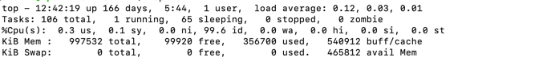
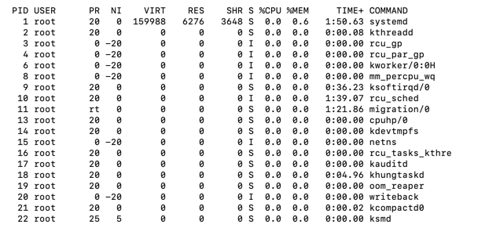

## top을 통해 살펴보는 프로세스 정보들

### 1.시스템 정보 살피기

: 운영된 시간, 로그인한 사용자의 정보, load average를 알 수 있다.  
 
+) `load average`란 현재 시스템이 얼마나 많은 일을 하고 있는지 알려주는 정도이다. 높을 수록 서버가 많을 일을 한다는 것을 의미한다.  
+) `-b`라는 옵션을 주지 않으면 화면을 갱신하면서 보여준다.

1. `PR` : 프로세스의 실행 우선순위 여부이다.  
2. `NI` : PR 값을 얼마로 조절할 것인지를 결정한다.
3. `VIRT, RES, SHR` : 프로세스가 사용하는 메모리의 양이 얼마인지 확인할 수 있는 정보이다. 이를 통해 프로세스의 매모리 누수를 확인할 수 있다.  
4. `S` : 프로세스의 상태를 나타내는 정보이다. 현재 IO를 기다리는 상태인지, 작업상태인지, 쉬는 상태인지 알 수 있다.  

+) S : sleeping, W : swapped out process, Z: zombies, R: running

 

### 2. VIRT, RES, SHR..?
이 세가지 항목은 현재 프로세스가 사용하고 있는 메모리와 관련된 정보이다.    
  
  
**VIRT**
: task가 사용하고 있는 virtual memory의 전체 용량이다.  
-> 프로세스에 할당된 가상 메모리의 전체이다.  
-> 실제로 할당되지 않은 가상의 공간이기에 해당 값이 커도 문제가 되지 않는다.

**RES**
: task가 사용하고 있는 물리 메모리의 양이다.  
-> 실제 사용하고 있는 영역이기에 메모리 점유율이 높은 프로세스를 찾기 위해서는 이 영역이 높은 프로세스를 찾아야 한다.  

**SHR**
: 다른 프로세스와 공유하고 있는 shared memeory의 양이다.  

### 3. VIRT와 RES 그리고 Memory Commit의 개념
둘이 같은 메모리지만 따로 구분되어 있는 이유는?!!  
  
`VIRT`는 가상 메모리로 프로세스가 커널로부터 사용을 예약받은 메모리라고 생각할 수 있다. 
예시로는 `malloc`과 같은 시스템 콜을 통해 메모리 영역을 할당해 줄 것을 요청한다.  
가능한 공간이 있다면 성공과 함께 가상의 메모리 주소를 전달해준다.  

하지만 물리 메모리에 해당 영역이 할당되는 것은 아니다.  이런 동작 방식을 `memory commit`이라고 한다.  커널 파라미터 중에 `vm.overcommit_memory`를 통해 동작 방식을 정의할 수 있다.  
프로세스가 할당받은 메로리 영역에 실제로 쓰기 작업을 수행하면 page fault가 발생하며 그 때 커널이 실제 물리 메모리를 프로세스의 가상 메모리 공간에 매핑한다.  
  
이것은 page table이라고 불리는 커널의 전역변수로 관리된다.  
  
이렇게 물리 메모리로 바인딩된 영역이 RES이다.  

### 4. 프로세스의 상태 보기

