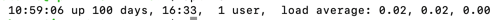

## Load Average와 시스템 부하 ㄷ ㄷ

### 1. load average  
얼마나 많은 프로세스가 실행 중인지 혹은 실행 대기중인지를 의미한다.  
-> 높다면? 많은 수의 프로세스가 실행 중, I/O 등을 처리하기 위한 대기 상태에 있는 중  
-> 냦다면? 적은 수의 프로세스가 실행 중, 대기 중   
  
+)  프로세스의 개수를 세기에 CPU core의 수가 몇 개냐에 따라 의미가 상대적이다.  
그래서 코어의 개수보다 프로세스가 많다면 현재 시스템이 처리할 수 있는 프로세스보다 조금 더 많은 프로세스가 있다는 뜻  

  <br/>

### 2. load average의 계산 과정   

사용할 명령어는 바로 `uptime`



`uptime`이 읽는 것은 `/proc/loadavg`를 읽는다.  

이 값들은 어디서 왔을까?  

해당 소스는 `loadavg_proc_show()` 함수를 통해 알 수 있다.  

배열에서 1분, 5분, 15분 값의 평균값들이 `avnrun`이란 배열로 들어간다.  
해당 값들을 토대로 load average 값을 출력한다.  

`grep`을 통해서 `get_avnrun()`함수를 찾을 수 있다. 하지만 더 파고 파고 들어가서 `calc_global_load()`함수에서 찾을 수 있다.  


  
> `calc_load_tasks`을 `atomic_long_read`라는 함수를 통해 읽어와 `active` 변수에 넣는다.  
`active` 값을 통해 `avenrun` 배열에 있는 값들을 `calc_load()`함수를 이용해서 계산한다. 

이를 통해 `calc_load()`함수와 `active` 변수가 중요하는 것을 알 수 있다.  

또 `grep`을 이용해서 `calc_load()`함수를 알아보자.  

  
```C
    static void calc_load_account_active(struct rq *this_rq){
        long nr_active, delta;
        
        nr_active = this_rq -> nr_running;
        nr_active += (long) this_rq -> nr_uninterruptible;
        
        if(nr_active != this_rq -> calc_load_active) {
            delta = nr_active - this_rq -> cal_load_active;
            this_rq -> calc_load_active = nr_active;
            atomic_long_add(delta, &calc_load_tasks); 
        }
    }
```
nr_active 변수에 run queue를 기준으로 nr_running 상태의 프로세스 개수를 입력한다.  (R의 상태)  
nr_active 변수에 run queue를 기준으로 nr_uninterruptible 상태의 프로세스 개수를 더해준다, (D의 상태)  

이 값이 기존에 계산된 값과 다르다면 차이만큼 구한 값을 구한 후 calc_load_tasks 변수에 입력한다.  

이렇게 cpu_load_account_active 함수가 매번 틱 주기마다 깨어나서 현재 CPU의 run queue에서 nr_running상태와 nr_uninterruptible상태의 프로세스의 개수를 세어서 caclc_load_tasks 변수에 넣어준다.  

> 결론: 프로세스의 개수를 센다! 


<br/>


### 3. CPU bound vs I/O bound

그런데 load average는 계산하는 순간을 기준으로 존재하는 값이기에 프로세스가 단순히 많다는 뜻이 아니고 i/o에 병목이 생겨 대기하는 프로세스가 많을 수도 있다.   
이 값만을 통해서 시스템에 어떤 부하가 일어났는지 알 수 없다.    

   
> 그렇다면 부하를 일으키는 프로세스의 종류는 뭐가 있을까?
> 1. 많은 cpu 자원을 필요로 하는 cpu bound
> 2. 많은 i/o 자원을 필요로 하는 io bound


테스트를 통해 살펴본 둘의 부하는 다른 종류이다.
1번은 cpu 리소스를 너무 많이 사용해서 발생하는 부하이고, 2번은 io 리소스를 너무 많이 사용해서 발생하는 부하이다.  

그렇다면 어떤 부하인지 알 수 있을까??!!!

<br/>

### 4. vmstat으로 부하의 정체 확인하기  

vmstat을 이용해서 시스템의 상태를 확인할 수 있다.  

근데 둘의 부하의 차이는 무엇일까? 바로 r과 b 칼럼을 통해 알 수 있다.    
  
r은 실행되기를 기다리거나 현재 실행되고 있는 프로세스의 개수 -> `nr_running`  
b는 i/o를 위해 대기열에 있는 프로세스의 개수 -> `nr_uninterruptible`  
  
그렇다면 r는 cpu_bound, b는 i/o bound라고 생각할 수 있겠다.  

<br/> 

### 5. load average가 시스템에 미치는 영향  

실은 비슷한 수치여도 원인이 무엇이냐에 따라 다를 수 있다.  

우리가 돌리는 프로세스가 어떤 시스템 자원을 많이 쓰느냐에 따라서 부하가 시스템에 미치는 영향이 다르다.  

<br/>

### 6. case study - os버전과 load average  

  같은 운영체제라고 해도 버전에 따라 load average가 다르다.  
    
`/proc/sched_debug`를 보면 더 상세하게 살펴볼 수 있다.  
해당 파일에서는 cpu의 run queue 상태와 스케쥴링 정보를 볼 수 있다.  

  
이 항목을 통해 runnable tasks의 수가 다르다는 것을 알 수 있다.  
이를 통해 현재 커널에서 측정 값에 문제가 있다는 것을 알 수 있다.  

  하나의 지표로만 모니터링하거나 시스템의 상태를 확인하지 말고 다양한 지표를 사용해서 알아봐야 한다.  
  
