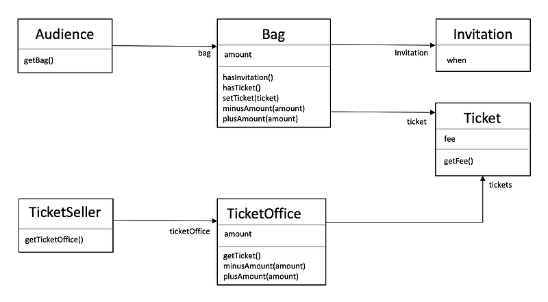

## 1장 객체, 설계

- 티켓 판매 애플리케이션 구현
: 소극장에서 티켓을 판매하며 이벤트로 공연을 무료로 관람할 수 있는 초대장이 있다.
이벤트에 당첨된 사람은 초대장을 티켓으로 교환한 후에 입장할 수 있다. 이벤트에 당첨되지 않은 고객은 티켓을 구매해야만 
입장할 수 있다.

```java
    public class Invitation {
        private LocalDateTime when;
}
```

```java
    public class Ticket{
        private Long fee;
        public Long getFee(){
            return fee;
        }
}
```

```java
    public class Bag{
        private Long amount;
        private Invitation invitation;
        private Ticket ticket;

        public Bag(long amount) {
            this(null, amount);
        }
        
        public Bag(Invitation invitation, long amount) {
            this.invitation = invitation;
            this.amount = amount;
        }
        
        public boolean hasInvitation(){
            return invitation != null;
        }
        
        public boolean hasTicket(){
            return ticket != null;
        }
        
        public void setTicket(Ticket ticket){
            this.ticket = ticket;
        }
        
        public void minusAmount(Long amount){
            this.amount -= amount;
        }
        
        public void plusAmount(Long amount) {
            this.amount += amount;
        }
}
```
```java
    public class Audience {
        private Bag bag;
        
        public Audience(Bag bag) {
            this.bag = bag;
        }
        
        public Bag getBag() {
            return bag;
        }
}
```

```java
    public class TicketOffice {
        private Long amount;
        private List<Ticket> tickets = new ArrayList();
        
        public TicketOffice(Long amount, Ticket ... tickets) {
            this.amount = amount;
            this.tickets.add(Arrays.asList(tickets));
        }
        
        public Ticket getTicket() {
            return tickets.remove(0);
        }
        
        public void minusAmount(Long amount) {
            this.amount -= amount;
        }
        
        public void plusAmount(Long amount) {
            this.amount += amount;
        }
}
```

```java
    public class TicketSeller {
    private TicketOffice ticketOffice;

    public TicketSeller(TicketOffice ticketOffice) {
        this.ticketOffice = ticketOffice;
    }

    public TicketOffice getTicketOffice() {
        return ticketOffice;
    }
}
```



```java
    public class Theater {
        private TicketSeller ticketSeller;
        
        public Theater(TicketSeller ticketSeller) {
            this.ticketSeller = ticketSeller;
        }
        
        public void enter(Audience audience) {
            if(audience.getBag().hasInvitation()) {
                Ticket ticket = ticketSeller.getTicketOffice().getTicket();
                audience.getBag().setTicket(ticket);
            } else {
                icket ticket = ticketSeller.getTicketOffice().getTicket();
                audience.getBag().minusAmount(ticket.getFee());
                ticketSeller.getTicketOffice().plusAmount(ticket.getFee());
                audience.getBag().setTicket(ticket);
            }
        }
}
```
이 코드는 동작은 되지만 변경에 용이하지 않고 이해하기 어려운 코드이다.
관람객과 판매원이 소극장의 통제를 받는 수동적인 존재로 나타난다.
-> 애플리케이션의 기능을 구현하는데 필요한 최소한의 의존성만 유지하고 불필요한 의존성을 제거해야 한다.


### 1. 자율성을 높이자.
Theater가 Audience와 bag가지 접근할 수 있었던 코드에서 Audience가 Bag를 처리하고 TicketSeller가 TicketOffice를 관리하는 존재로 설계를 변경하자.
```java
    public class Theater {
        private TicketSeller ticketSeller;
        
        public Theater(TicketSeller ticketSeller) {
            this.ticketSeller = ticketSeller;
        }
        
        public void enter(Audience audience) {
            ticketSeller.sellTo(audience);
        }
}
```

```java
    public class TicketSeller {
    private TicketOffice ticketOffice;

    public TicketSeller(TicketOffice ticketOffice) {
        this.ticketOffice = ticketOffice;
    }
    
    public void sellTo(Audience audience) {
        if(audience.getBag().hasInvitation()) {
            Ticket ticket = ticketSeller.getTicketOffice().getTicket();
            audience.getBag().setTicket(ticket);
        } else {
            icket ticket = ticketSeller.getTicketOffice().getTicket();
            audience.getBag().minusAmount(ticket.getFee());
            ticketSeller.getTicketOffice().plusAmount(ticket.getFee());
            audience.getBag().setTicket(ticket);
        }
    }
}
```
ticketOffice에 대한 접근은 오직 TicketSeller에서만 존재한다.
-> 개념적이나 물리적으로 객체 내부의 세부사항을 감추는 것을 캡슐화라고 한다.
Theater는 TicketSeller의 인터페이스에만 의존한다. 

```java
    public class Audience {
        private Bag bag;
        
        public Audience(Bag bag) {
            this.bag = bag;
        }
        
        public Long buy(Ticket ticket){
            if(bag.hasInvitation()) {
                bag.setTicket(ticket);
                return 0L;
            } else {
                bag.setTicket(ticket);
                bag.minusAmount(ticket.getFee());
                return ticket.getFee();
            }
        }
}
```

```java
    public class TicketSeller {
    private TicketOffice ticketOffice;

    public TicketSeller(TicketOffice ticketOffice) {
        this.ticketOffice = ticketOffice;
    }
    
    public void sellTo(Audience audience) {
        ticketOffice.plusAmount(audience.buy(ticketOffice.getTicket()));
    }
}
```
TicketSeller와 Audience 사이의 결합도가 낮아졌다. 내부 구현이 캡슐화되어있어 구현을 수정하더라도 영향을 미치지 않는다.

밀접하게 연관된 작업만을 수행하고 연관성 없는 작업은 다른 객체에게 위임하는 객체를 가리켜 응집도가 높다고 말한다.
객체의 응집도를 높이기 위해서는 객체 스스로 자신의 데이터를 책임져야 한다.

책임의 이동


하나의 기능을 완성하는데 필요한 책임이 여러 객체에 걸쳐 분산되어 있다.
