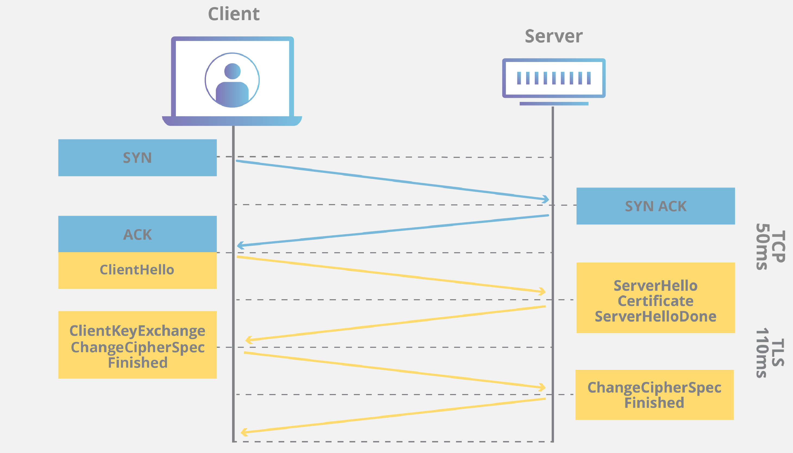

## * HTTPS
: 웹 브라우저와 웹 서버에 사용하는 HTTPS로 인터넷 콘텐츠를 전달하는 TCP 프로토콜의 일종인 HTTP에 S(Security) 기능을 더한 것이다. 

### * HTTPS의 기술
: SSL(Secure Socket Layer)과 TLS(Transport Layer Security) 전송 기술이 있다. 
: 둘 다 안전한 계층(Layer)을 웹 통신에 추가하는 방식이다.
: 이 기술을 수행하기 위해 웹 서버에 설치하는 것이 SSL/TLS 인증서이다. 

### * SSL HandShake 과정
: SSL 인증서 전달, 대칭키 전달, 암호화 알고리즘 결정, SSL/TLS 프로토콜 결정 등이 포함된다.

1. ClientHello
: 브라우저가 원하는 SSL 혹은 TLS 버전 정보, 브라우저가 지원하는 암호화 방식, 브라우저가 순간적으로 생성한 임의의 난수를 보낸다.  

2. ServerHello
: 서버가 암호화 방식을 선택하고 서버의 공개키가 담긴 SSL 인증서, 서버가 순간적으로 생성한 임의의 난수를 보낸다.  
3. 클라이언트는 서버의 SSL 인증서가 올바른지 확인한다. 서버가 보낸 SSL 인증서가 정말 CA가 만든 것인지 확인하기 위해 내장된 CA 공개키로 암호화된 인증서를 복호화한다.  

4. 클라이언트는 자신이 생성한 난수와 서버의 난수를 이용하여 premaster secret를 만든다. 

5. 서버는 사이트의 비밀키로 브라우저가 보낸 premaster secret값을 복호화한다. 복호화한 값을 master secret 값으로 저장하여 세션키를 생성한다. 이를 이용하여 브라우저와 서버 사이에 주고 받는 데이터를 암호화하고 복호화한다. 

6. 서버와 클라이언트는 SSL handshake를 종료하고 HTTPS 통신을 시작한다. 