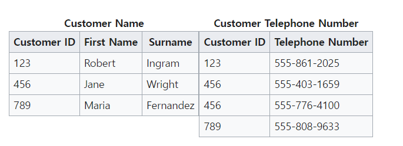
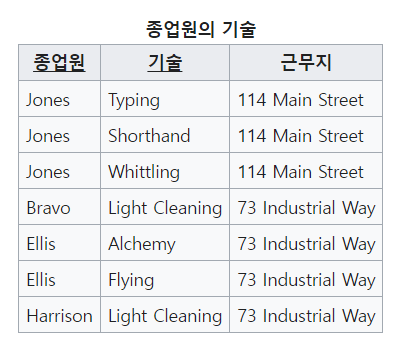
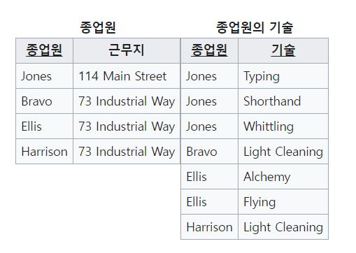

## * ERD
: ERD는 시스템 요구 사항을 기반으로 작성되며 ERD를 기반으로 데이터베이스를 구축한다.  
: 구축한 후에도 디버깅 또는 비즈니스 프로세스 재설계가 필요한 경우에 설계도 역할을 담당한다.  
: 관계형 구조로 표현할 수 있는 데이터를 구성하는 데 유용하다.  

## * 정규화 과정
: 릴레이션 간의 잘못된 종속 관계로 인해 데이터베이스 이상 현상이 발생하여 이를 해결하거나, 저장 공간을 효율적으로 사용하기 위해 릴레이션을 여러 개로 분리하는 과정이다.  
: 정규화 과정은 정규형 원칙을 기반으로 정규형을 만들어가는 과정이며, 정규화된 정도는 졍규형으로 표현한다.    
: 기본 정규형인 제1정규형, 제2정규형, 제3정규형, 보이스/코드 정규형이 있다.  
: 고급 정규형인 제4정규형, 제5정규유형이 있다.  

 

### * 0. 정규형 원칙
: 같은 의미를 표현하는 릴레이션이지만 좀 더 좋은 구조로 만들어야 한다.  
: 자료의 중복성은 감소해야 한다.  
: 독립적인 관계는 별개의 릴레이션으로 표현해야 한다.  
: 각각의 릴레이션은 독립적인 표현이 가능해야 한다.  

 

### * 1. 제1정규형
: 릴레이션의 모든 도메인이 더 이상 분해될 수 없는 원자값으로만 구성되어야 한다.  
: 릴레이션의 속성 값 중에서 한 개의 기본키에 대해 두 개 이상의 값을 가지는 반복 집합이 있으면 안된다.  

 

### * 2. 제2정규형
: 릴레이션이 제1정규형이며 부분 함수의 종속성을 제거한 형태이다.  
: 부분 함수의 종속성 제거란 기본키가 아닌 모든 속성이 기본키에 완전 함수 종속적인 것을 의미한다.  

: 위의 그림과 같이 종석성을 제거하는 것이다.  

 

### * 제3정규형 
: 제2정규형이고 기본키가 아닌 모든 속성이 이행적 함수 종속을 만족하지 않는 상태이다.  

 

+) `이행적 함수 종속`이란?  
: A -> B 와 B -> C가 존재하면 논리적으로 A -> C가 성립하는데 이 때 집합 C가 집합 A에 이행적으로 함수 종속이 되었다고 한다.  

 

<image src="../image/3nf1.png">
<image src="../image/3nf2.png">
: 위의 예제와 같이 대회 + 연도 -> 우승자 -> 우승자 생년 월일로 나타나있다.  
: 대회 + 연도 + 우승자, 우승자 + 우승자 생년월일로 나타낼 수 있다.  

 

### * 4. 보이스/코드 정규형 (BCNFD)
: 제3정규형이고 결정자가 후보키가 아닌 함수 종속 관계를 제거하여 릴레이션의 함수 종속 관계에서 모든 결정자가 후보키인 상태를 말한다.  

 

+) `결정자`란?  
: 함수 종속 관계에서 특정 종속자를 결정짓는 요소  
: X -> Y 이면 X는 결정자, Y는 종속자이다.  

 
