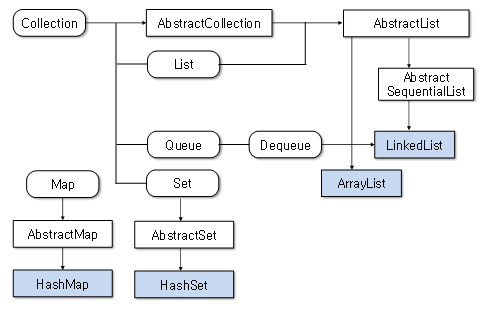

## * Collection
: 객체를 수집해서 저장하는 역할을 한다.  
: 자바 컬렉션 프레임워크는 몇 가지 인터페이스를 통해서 다양한 컬렉션 클래스를 이용할 수 있도록 하고 있다.   
: 주요 인터페이스로는 `List`, `Set`, `Map`이 있다.    

 

 

1. `ArrayList`, `Vector`, `LinkedList`는 `List` 인터페이스를 구현한 클래스로 `List` 인터페이스로 사용 가능한 컬렉션이다.  
2. `HashMap`, `Hashtable` ,`TreeMap`, `Properties`는 `Map` 인터페이스를 구현한 클래스로 `Map` 인터페이스로 사용 가능한 컬렉션이다.  

 

### * List와 Set
: 둘은 객체를 추가, 삭제, 검색하는 방법에 많은 공통점이 있어 인터페이스의 공통된 메소드들만 모아 `Collection` 인터페이스로 정의하고 있다.  

1. `List`
: 순서를 유지하고 저장  
: 중복 저장 가능  

2. `Set`
: 순서를 유지하지 않고 저장  
: 중복 저장 불가능  

3. `Map`
: 키와 값을 하나의 쌍으로 묶어서 관리하는 구조  
: 키는 중복 저장이 안된다.  

 

## List
: 객체를 일렬로 늘어놓은 구조를 가지고 있다.  
: 객체를 인덱스로 관리하기 때0문에 객체를 자정하면 자동으로 인덱스가 부여된다.  
: 해당 인덱스로 객체를 검색, 삭제할 수 있는 기능을 제공한다.  
: List 컬렉션은 객체 자체를 저장하는 것이 아니라 객체의 번지를 참조한다.  
: 동일한 객체를 중복 저장할 수 있으며 이 경우 동일한 번지가 참조된다.  

 

## Set
: 저장 순서를 유지하지 않는다.  
: 객체를 중복해서 저장할 수 없으며 하나의 null만 저장할 수 있다.  
: 인덱스로 관리하지 않아 인덱스를 매개값으로 갖는 메소드가 없다.  
: 값을 검색할 때 반복자 `iterator`를 이용하여 얻을 수 있다.  

 

## Map
: `key` - `value`로 구성된 Entry 객체를 저장하는 구조를 가지고 있다.  
: 여기서 키와 값은 모두 객체이다.  
: 키는 중복 저장될 수 없지만 값은 중복 저장될 수 있다.  