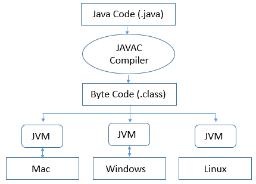
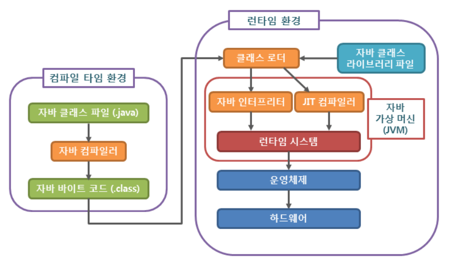

## JVM이란?

`Java Virtual Machine`으로 자바 프로그램 실행환경을 만들어주는 소프트웨어이다.

1. 자바 프로그램이 어느 기기, 어느 운영체제 상에서도 실행될 수 있게 만들어준다.
2. 자바 프로그램의 메모리를 효율적으로 관리 + 최족화해준다.  => `Garbage Collection`

자바 코드를 컴파일하여 `.class` 바이트 코드를 만들면 해당 코드가 `JVM` 환경에서 실행된다.

= 각자의 플랫폼에 설치되어 있는 `JVM`이 운영체제에 맞는 실행 파일로 바꿔준다.    
= 자바에서는 `JVM`을 사용하기 때문에 각자의 플랫폼에 맞게끔 컴파일을 따로따로 해줘야 할 필요가 없다.

 

**`java`는 플랫폼에 종속적이지 않지만 `JVM`은 플랫폼에 종속적이다.**

### 자바 프로그램 실행 과정과 JVM

1. 자바로 `.java` 파일을 작성한 후에 터미널에서 자바 컴파일러인 `javac`에 컴파일 명령을 내리면 `.class` 파일이 만들어진다.
2. 해당 바이트 코드는 클래스 로더를 통해 `JVM Runtime Data Area`로 로딩된다.
3. 로딩된 `.class` 바이트 코드를 실행할 컴퓨터에 깔린 `JVM`에 가져다 주면 그 컴퓨터가 이 프로그램을 실행할 때 이 `JVM`이 기계어로 해석한다.

 

**+) `JVM`이 바이트 코드를 읽는 방식**    
`JVM`은 기계어로 변경해 명령어 단위로 읽어서 실행한다.    
`interpreter` 방식과 `jit(just in time)` 컴파일 방식 두 가지를 혼합하여 사용한다.

++) `interpreter` 방식
: 바이트 코드를 한 줄 씩 해석해서 실행하는 방법으로 속도가 느리다는 단점이 있다.

++) `jit` 방식
: 실행하는 시점에 각 OS에 맞는 `Native Code`로 변환하는 방식으로 속도가 빠르지만 비용이 많이 든다.

