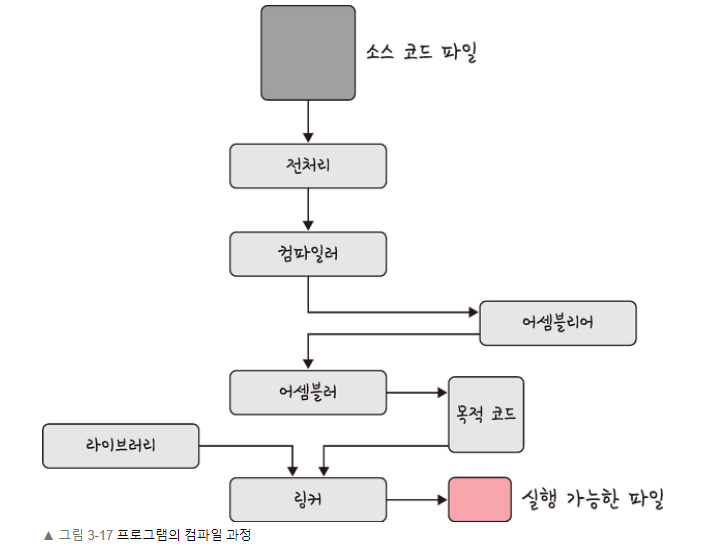

## * 컴파일 과정
: 프로그램은 컴파일러가 컴파일 과정을 거쳐 컴퓨터가 이해할 수 있는 기계어로 번역되어 실행될 수 있는 파일이 되는 것을 의미한다.  

1. 전처리 
: 소스 코드의 주석을 제거하고 `#include` 등 헤더 파일을 병합하여 매크로를 치환한다.  

2. 컴파일러
: 오류 처리, 코드 최적화 작업을 하며 어셈블리어로 변화한다.

3. 어셈블러
: 목적 코드로 변환한다. 확장자는 운영체제마다 다르며 리눅스에서는 `.o`이다.    
: 예를 들어 `compile.c` 파일을 만들면 `compile.o` 파일이 생성된다.  

4. 링커
: 프로그램 내 있는 라이브러리 함수 또는 다른 파일들과 목적 코드를 결합하여 실행 파일을 생성한다.  
: 실행 파일의 확장자는 `.exe` 또는 `.out`이라는 확장자를 갖는다.   

