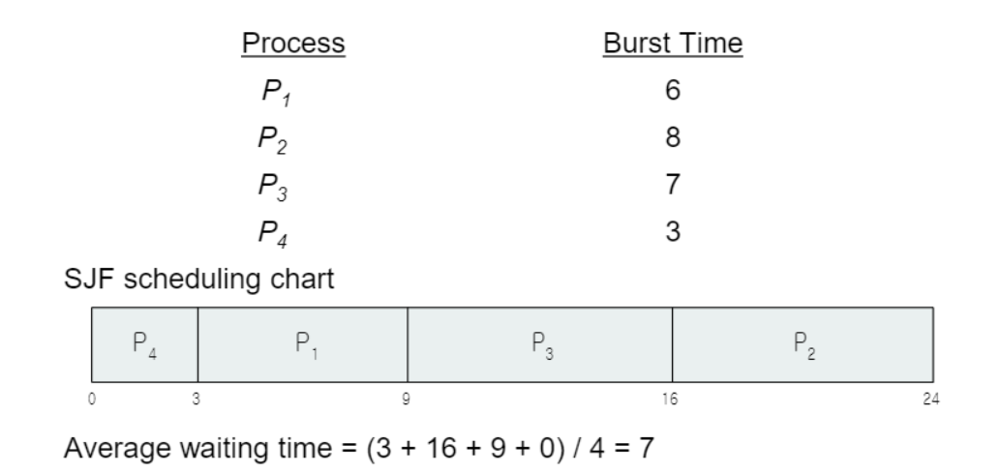

## CPU Scheduling

### 기준
* 최대화   
1. CPU 활용률 - CPU를 최대한 바쁘게 유지해야 한다.    
2. 결과물 - 한번의 시간 단위 당 작업을 완수하는 프로세스의 개수   

 

* 최소화   
1. 소요 시간 - 특정 프로세스를 실행하는데 걸리는 시간  
2. 대기 시간 - `ready queue`에서 프로세스가 대기하는 시간   
3. 응답 시간 - 요청이 들어온 후에 첫 응답이 나갈 때까지의 시간  

 

## 알고리즘
- FCFS, SJF, RR, Priority Scheduling  
- 측정 요소로는 평균 대기 시간을 사용한다.  

## 1. FCFS

`First come, first served`로 들어오는 프로세스의 순서대로 실행한다.    

결론적으로 낮은 CPU와 장치 사용률을 보인다.  

 

## 2. SJF  

사용하는 시간이 가장 짧은 프로세스를 먼저 실행한다.  
대기 시간이 가장 짧은 방법이다.  

### SRTF

SJF의  선점형 버전으로 `shortest-remaining-time-first`이다.  
이는 계속해서 선점함으로 `starvation` 문제가 발생한다.  

 

## 3. Priority Scheduling  

각 프로세스에는 우선순위(숫자)가 있다.  
CPU는 우선순위가 높은 프로세스에게 할당된다.  
단점으로는 `starvation`이 있으며 해결책으로는 `aging`이 있다.  

 

+) aging?
- 시간이 지남에 따라 프로세스의 우선순위를 높이는 것을 의미한다. 

 

## 4. Round Robin

`time quantum`이라는 CPU 시간의 단위를 각 프로세스는 갖는다.  
매우 작은 시간동안 프로세스는 실행되며 다 끝나지 못한 경우 다시 `ready queue`의 끝에 들어간다.  

위의 그림에선 `time quantum`이 4이다.  

- 긴 `time quantum`인 경우 -> FIFO
- 짧은 `time quantum`인 경우 -> overhead가 매우 커짐.  