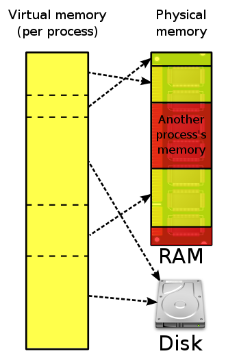

## * 메모리 관리  
: 운영체제의 대표적인 일 중에 하나로 컴퓨터 내에 한정된 메모리를 최대한으로 활용해야 한다.    

 

### 가상 메모리  
: 메모리 관리 기법 중 하나로 컴퓨터가 실제로 이용 가능한 메모리 자원을 추상화하여 사용자들에게 더욱 큰 메모리로 보이게 만드는 것이다.    

  

이 때의 가상적으로 주어진 주소는 논리 주소이다.    
실제 메모리 상에 있는 주소는 물리 주소이다.    
가상 주소는 메모리관리장치에 의해 물리 주소로 변환되어 사용자는 물리 주소를 의식할 필요 없이 프로그램을 구축할 수 있다.    

가상 메모리는 가상 주소와 실제 주소가 매핑되어 있고 프로세스의 주소 정보가 들어있는 페이지, 테이블로 관리된다.    
이 때 속도 향상을위해 TLB를 사용한다.  

+) TLB란?  
: 메모리와 CPU 사이에 있는 주소 변환을 위한 캐시이다.    
페이지 테이블에 있는 리스트를 보관하며 CPU가 페이지 테이블까지 가지 않도록 하여 속도를 향상시킬 수 있는 캐시 계층이다.  

 

### 스레싱  
: 메모리의 `page fault `비율이 높은 것을 의미한다.
: 이는 컴퓨터의 성능 저하를 유발한다.   

메모리에 너무 많은 프로세스가 동시에 올라가게 되면 스와핑이 많이 일어나 발생하는 것이다.  
page fault가 발생하면 CPU 이용률이 낮아진다.  
CPU 이용률이 낮아지면 OS가 더 많은 프로세스를 메모리에 올리게 된다.   
이를 해결하기 위해 working set, PFF가 존재한다. 

 

### 메모리 할당  
: 메모리에 프로그램을 할당할 때 시작 메모리 위치, 메모리의 할당 크기를 기반으로 할당한다.    
: 이 때 할당은 연속 할당과 불연속 할당으로 나뉜다.    

 

1. 연속 할당  
: 메모리에 연속적으로 공간을 할당하는 것이다.  
    a. 고정 분할 할당  
    : 메모리를 미리 나누어 관리하는 방식   
    b. 가변 분할 할당  
    : 매 시점 프로그램의 크기에 맞게 동적으로 메모리를 나누어 사용하는 방식  

2. 불연속 할당  
    a. 페이징  
    : 동일한 크기의 페이지 단위로 나누어 메모리의 서로 다른 위치에 프로세스를 할당한다.    
    b. 세그멘테이션  
    : 페이지 단위가 아닌 의미 단위인 세그먼트로 나누는 방식이다.    
    : 코드와 데이터 뿐만 아니라 함수 단위로도 나눌 수 있다.    
    c. 페이지드 세그멘테이션  
    : 공유나 보안을 의미 단위인 세그먼트로 나누고 물리적인 메모리는 페이지로 나누는 방식이다.    