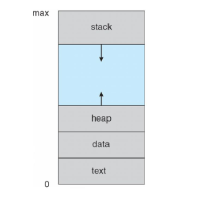
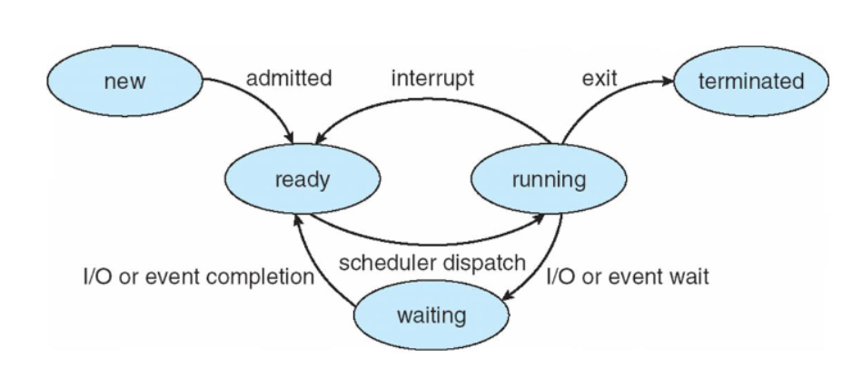
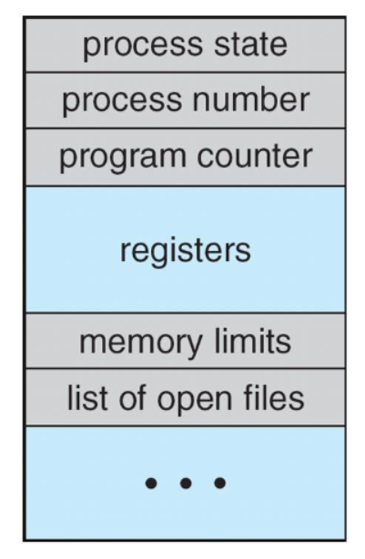
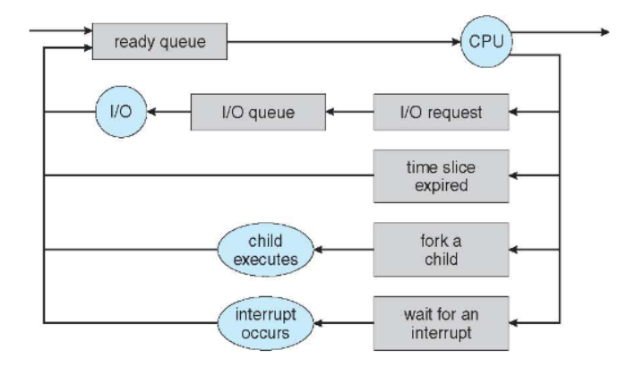

## * process란?
 -> 실행 중인 프로그램으로  메모리에 올라간 프로그램을 뜻한다.

-> 하나의 프로그램에서 여러 프로세스가 생길 수 있다.

 

### 1. process 개념

프로세스는 여러 부분으로 구분되며 stack, heap, data, text로 이루어져있다.

+) data 안에서도 initialized data와 uninitialized data로 구분된다.

### 2. process state

new - 처음 만들어졌을 때 생성된 상태

ready - 준비 작업이 끝난 실행 가능한 상태

run - 지금 CPU에서 돌아가는 상태

wait - I/O 요청으로 인해 기다려야 하는 상태

terminate - 프로세스의 실행이 다 끝난 상태

### 3. PCB (process control block)

PCB는 유지해야 하는 독립된 자료구조이다.

process state - 앞서 말한 프로세스의 상태이다.

program counter - 실행할 명령어의 주소로 유지 목적으로 사용된다.

CPU register - 모든 프로세스의 레지스터 정보가 들어있다.

CPU scheduling information - 우선순위(nice value), 스케쥴링 큐 포인터 정보를 담고 있다.

memory-management information - 프로세스에 할당되는 메모리 정보를 담고 있다.

accounting information - 사용된 CPU, time limits 등

I/O status information - 프로세스에 할당된 I/O 장치들 등

### 4. Process scheduling

OS가 process scheduler를 통해 프로세스 실행을 결정한다.

#### * scheduling queue

- job queue

- ready queue : 실행 가능한 프로세스들(PCB)를 가리키는 포인터들

- device queue 

 

새로운 프로세스는 초기에 ready queue에 놓인 다음 선택이 되면 ready queue에서 나와 run상태가 된다.

1. ready queue에서 CPU에 할당받는 것은 short-term scheduler에 의해서 실행된다.

   이는 하나가 선택된 것을 dispatch라고 부른다.

2. 프로세스가 생성되어 new상태로 되었다가 준비가 끝나 ready 상태가 되는 것은 long-term scheduler에 의해서 실행된다.

3. 메모리의 공간이 부족할 때 medium-term scheduler를 통해 사용하지 않은 프로세스를 제거할 수 있다.

 

+) 프로세스를 I/O 중심 process와 CPU 중심 process로 나눌 수 있다.