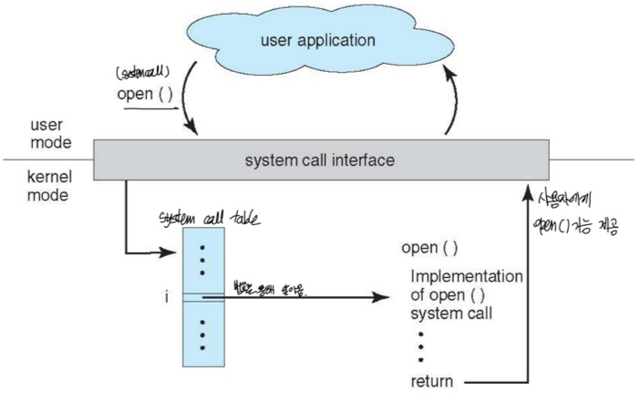

## * System call
: OS에 의해 제공되는 프로그래밍 인터페이스로 서비스를 제공한다.  
ex) Win32 API for Window, POSIX API for POSIX-based systems, Java API for JVM.  
: 커널에게 부탁하여 기능이 돌아가는 것  

### * 구현
: 각각의 시스템 콜은 숫자로 연결되어 있다.  
: System call interface는 그런 숫자들로 연결된 system call table을 유지한다.  
: 번호를 통해 해당 시스템 콜을 사용자에게 제공한다.

