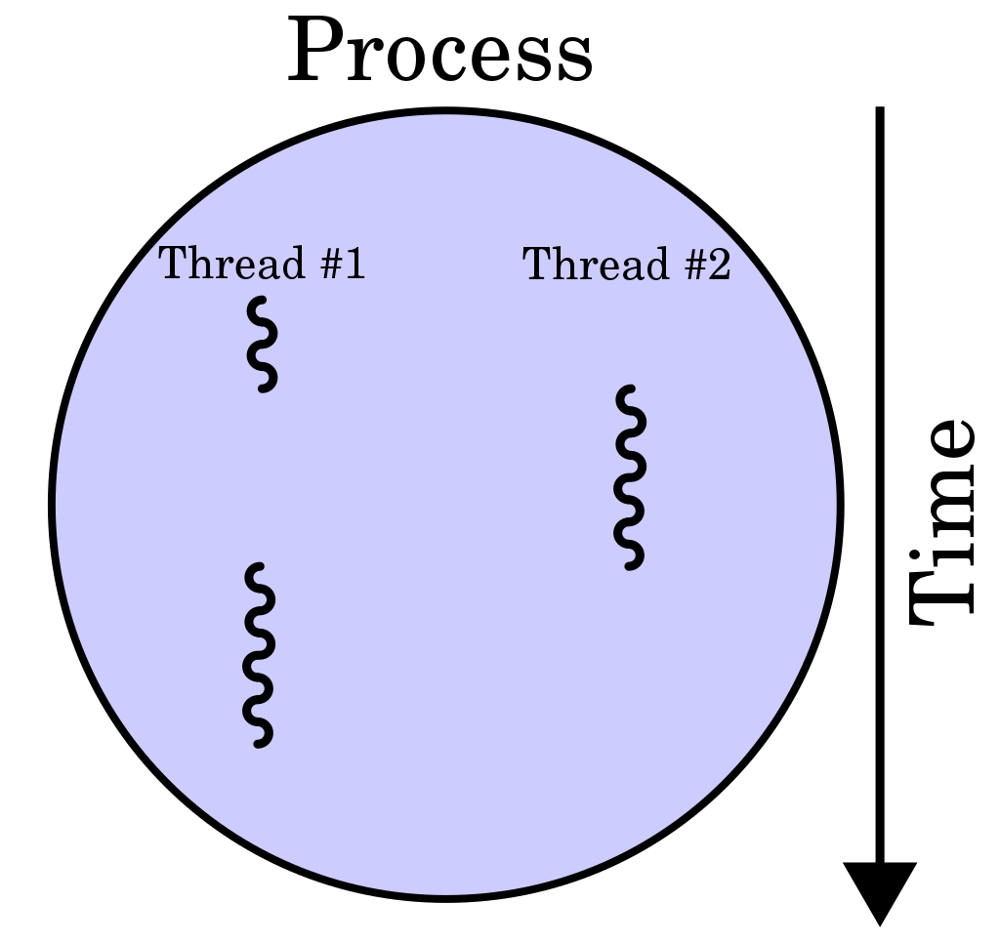

## 스레드
: 프로세스의 실행 가능한 가장 단위이다.  
: 프로세스는 여러 스레드를 가질 수 있다.  

코드, 데이터, 스택, 힙을 각각 생성하는 프로세스와 달리 스레드는 코드, 데이터, 힙은 스레드끼리 서로 공유한다.  
그 외의 영역은 각자 생성된다.  

<br/>

## 멀티스레딩
프로세스 내 작업을 여러 개의 스레드, 멀티 스레드로 처리하는 기법이다.  
스레드끼리 서로 자원을 공유하기 때문에 효율성이 높다.  

한 스레드가 중단되어도 다른 스레드는 실행 상태일 수 있기 때문에 중단되지 않는 빠른 처리를 할 수 있다.  

한 스레드에 문제가 생기면 다른 스레드에도 영향을 끼쳐 스레드로 이루어져 있는 프로세스에 영향을 줄 수 있는 단점이 있다.  



### Java 예제
모든 자바 애플리케이션은 메인 스레드가 `main()` 메소드를 실행하면서 시작된다.  
메인 스레드는 `main()` 메소드의 첫 코드부터 아래로 순차적으로 실행하고, `main()` 메소드의 마지막 코드를 실행하거나 `return`문을 만나면 실행이 종료된다.  

메인 스레드는 필요에 따라 작업 스레드들을 만들어서 병렬로 코드를 실행할 수 있다.  
멀티 스레드를 생성해서 멀티 태스킹을 수행한다.  

*  생성 방법
1. Thread 클래스로부터 직접 생성
```java
    Thread thread=new Thread(Runnable target);
```
`Runnable`은 인터페이스 타입이기에 구현 객체를 만들어 대입해야 한다.  

```java
    class Task implements Runnable{
        public void run(){
            // 스레드가 실행할 코드 
        }
    }
```
스레드 객체를 생성한다. 
```java
    thread.start();
```
`start()`를 통해 메소드를 호출하여 `run()`함수 안의 작업 스레드를 실행한다. 