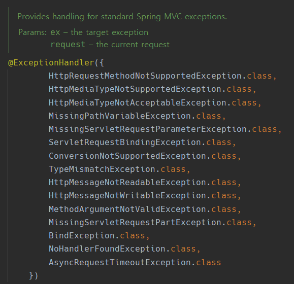
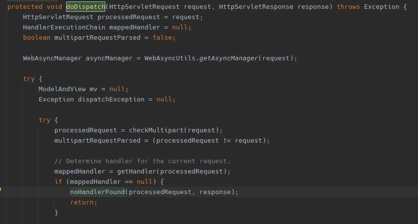
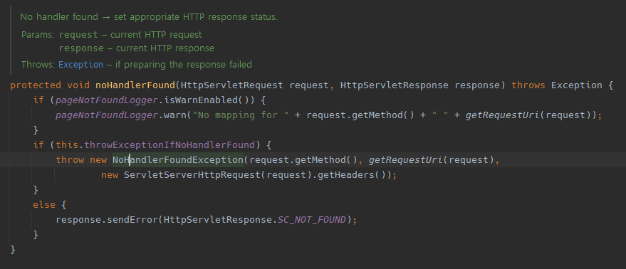

## 8월 2일 예외 처리하기

### 1. ExceptionHandler
평상시에 `ExceptionHandler`를 이용해서 해당 `Exception`이 발생하면 해당 에러를 핸들러로 넘겨 해결하는 방식을 이용함.

```java
	@ExceptionHandler(EntityNotFoundException.class)
	public ResponseEntity<ApiResponse> handleEntityNotFoundException(EntityNotFoundException exception) {
		val response = ApiResponse.fail(exception.getMessage());
		return new ResponseEntity<>(response, HttpStatus.NOT_FOUND);
	}
```
이 `ExceptionHandler`의 범위는 보통 `Controller` 어노테이션이 붙은 범위 내에서 적용이 가능하다.

<br/>

### 2. RestControllerAdvice
해당 `ExceptionHandler`를 한 곳에서 모아 관리하기 위해 `RestControllerAdvice` 어노테이션을 이용한다.

```java
    @RestControllerAdvice
    public class CustomExceptionHandler{
        public ResponseEntity<ApiResponse> handleEntityNotFoundException(EntityNotFoundException exception) {
		val response = ApiResponse.fail(exception.getMessage());
		return new ResponseEntity<>(response, HttpStatus.NOT_FOUND);
	}
    }
```

### 3. ResponseEntityExceptionHandler

이 외에도 해당 `response`에서 다른 값을 주고 싶다면 `ResponseEntityExceptionHandler`를 이용하는 방법이 있다.  


이에 해당하는 예외의 경우에는 그에 맞는 값을 핸들링하여 전달해준다.
```java
    if (ex instanceof HttpRequestMethodNotSupportedException) {
        HttpStatus status = HttpStatus.METHOD_NOT_ALLOWED;
        return handleHttpRequestMethodNotSupported((HttpRequestMethodNotSupportedException) ex, headers, status, request);
        }
```
이렇게 전달받아 개발자가 원하는 예외의 형식으로 커스텀할 수 있다.

- 적용 예시
```java
    @RestControllerAdvice
    public class CustomExceptionHandler extends ResponseEntityExceptionHandler {
        public ResponseEntity<ApiResponse> handleEntityNotFoundException(EntityNotFoundException exception) {
            val response = ApiResponse.fail(exception.getMessage());
            return new ResponseEntity<>(response, HttpStatus.NOT_FOUND);
        }
}
```
<br/>

### 4. 그 외의 예외 처리하기
위에서 언급한 `ResponseEntityExceptionHandler`를 이용해도 예외를 처리하지 못하는 경우가 있다.
스프링 자체적인 에러인 경우 예외처리를 거치지 않는다.

+) 잠깐,` DispatchServlet`이란?
- `controller`로 향하는 모든 웹 요청의 진입점이며, 이를 처리하고 결과 데이터를 `client`에게 전달한다.
    
  위와 같은 경우에 해당 핸들러를 찾지 못하면 `noHandlerFound`를 실행하게 된다.
     
  여기에서는 스프링 자체 정의한 에러  객체를 리턴하게 된다.

사용자가 지정한 에러를 처리하기 위해서는 밑의 코드를 .yml 폴더에 추가해야 한다.
```yml
    spring.mvc.throw-exception-if-no-handler-found= true
```

<br/>

## 결론!
기존의 예외처리에 `RespoonseEntityExceptionHandler` 상속받기, `spring.mvc.throw-exception-if-no-handler-found= true` 추가하기